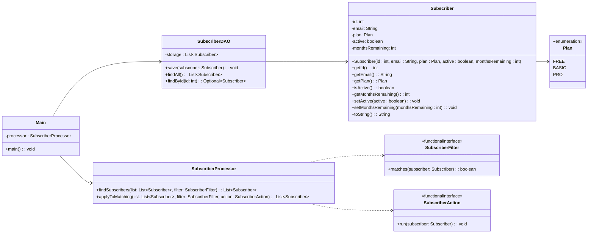

```mermaid
classDiagram
    direction LR

    class Subscriber {
        -id: int
        -email: String
        -plan: Plan
        -active: boolean
        -monthsRemaining: int
        +Subscriber(id : int, email : String, plan : Plan, active : boolean, monthsRemaining : int)
        +getId() : int
        +getEmail() : String
        +getPlan() : Plan
        +isActive() : boolean
        +getMonthsRemaining() : int
        +setActive(active : boolean) : void
        +setMonthsRemaining(monthsRemaining : int) : void
        +toString() : String
    }

    class Plan {
        <<enumeration>>
        FREE
        BASIC
        PRO
    }

    class SubscriberDAO {
        -storage : List~Subscriber~
        +save(subscriber: Subscriber): void
        +findAll(): List~Subscriber~
        +findById(id: int): Optional~Subscriber~
    }

    class SubscriberFilter {
        <<functionalinterface>>
        +matches(subscriber: Subscriber): boolean
    }

    class SubscriberAction {
        <<functionalinterface>>
        +run(subscriber: Subscriber): void
    }

    class SubscriberProcessor {
        +findSubscribers(list: List~Subscriber~, filter: SubscriberFilter): List~Subscriber~
        +applyToMatching(list: List~Subscriber~, filter: SubscriberFilter, action: SubscriberAction): List~Subscriber~
    }

    class Main {
        -processor : SubscriberProcessor
        +main() : void
    }

    Subscriber --> Plan
    SubscriberDAO --> Subscriber
    SubscriberProcessor ..> SubscriberFilter
    SubscriberProcessor ..> SubscriberAction
    Main --> SubscriberDAO
    Main --> SubscriberProcessor
```